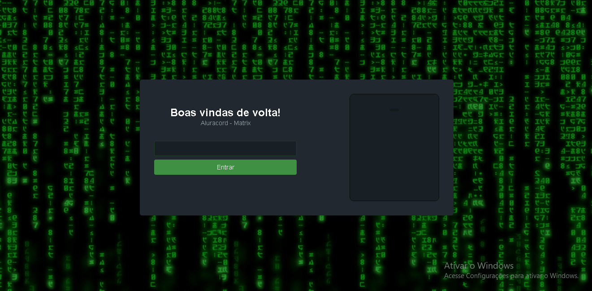

<div align='center'>
  
</div>

## Sobre o projeto 💬

O **AluraCord** é uma aplicação WEB sobre bate-papo virtual.

## Funcionalidades 🧠

A aplicação contém as seguintes funcionalidades:

### App.js 📕

- [x] Logar utilizando seu github.
- [x] Mandar mensagem e receber, em um grupo público.
- [x] Possibilidade de mandar imagens ou gifs pelo chat.
- [x] Site Responsivo.

## Pré-requisitos
- [x] Antes de começar, é bom ter instalado em sua maquina a seguinte ferramenta: [GIT](https://git-scm.com/) 
- [x] e também um editor para trabalhar com o codigo como o [VSCode](https://code.visualstudio.com/)

### Rodando o Projeto 📖

```bash
# Clone para este repositório
$ git clone <https://github.com/Pedro-AugusCoelho/AluraCod.git>

# Acesse a pasta do projeto no terminal/cmd
$ cd AluraCod

# Instale as dependências
$ npm/yarn install

# Execute a aplicação em modo de desenvolvimento
$ npm/yarn run start

# O servidor iniciará na porta:3000 - acesse <http://localhost:3000>
 
```

## Tecnologias 🛠

Desenvolvido utilizando as seguintes tecnologias:

- [CSS3](https://www.w3schools.com/css/)
- [JAVASCRIPT](https://www.javascript.com/)
- [REACT.JS](https://pt-br.reactjs.org/)
- [NEXTJS](https://nextjs.org/)
- [SUPABASE](https://supabase.com/)
- [SKYNEXUI](https://github.com/skynexui/components)

****************

<p align="center">Feito por: Pedro Augusto 🧑🏽🤙🏽</p>
